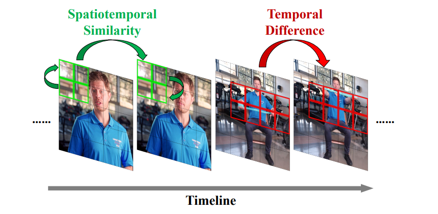
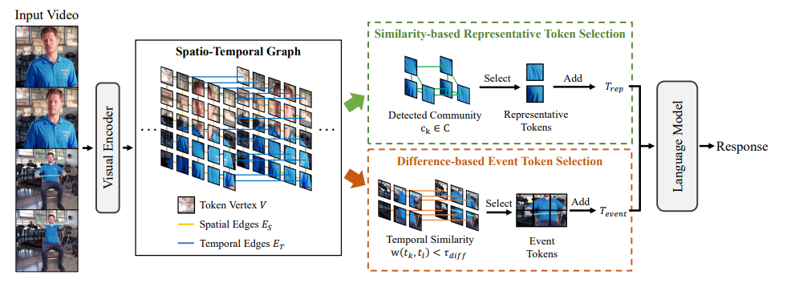
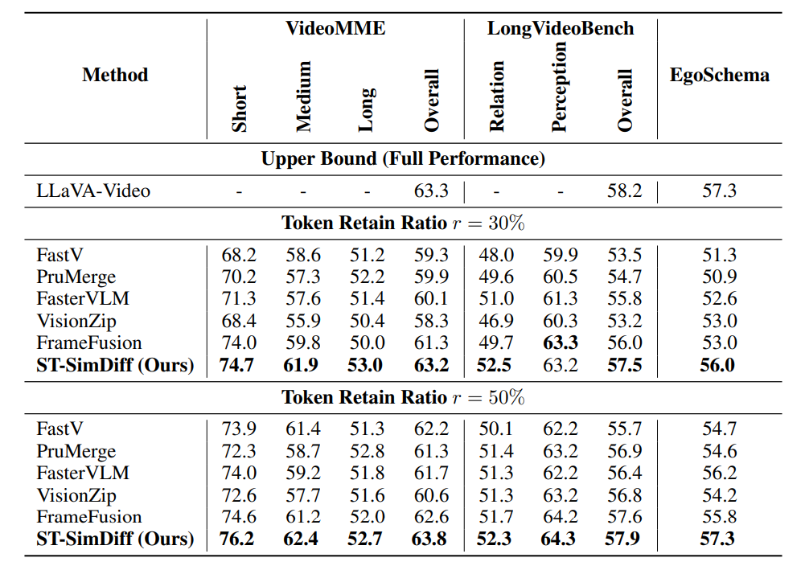

# ST-SimDiff: Balancing Spatiotemporal Similarity and Difference for Efficient Video Understanding with MLLMs

<div align="center">

**ICLR 2026 (Poster)**

[](https://openreview.net/forum?id=he8kYNcoMA)
[](https://arxiv.org/abs/2605.22158)
[](LICENSE)

</div>

---

## Overview



ST-SimDiff is a **training-free** spatiotemporal video token compression framework for Multimodal Large Language Models (MLLMs). It addresses two key limitations of prior work:

1. **Overlooked differences**: Most methods focus on *similarity* (redundancy) but miss critical *turning points* and dynamic events that drive video narratives.
2. **Lack of joint modeling**: Existing methods handle spatial or temporal correlations in isolation, missing complex spatio-temporal interactions.

**Core idea**: *similarity is for identifying redundancy; difference is for capturing key events.*



ST-SimDiff constructs a **spatiotemporal graph** over all visual tokens and applies a **parallel dual-selection strategy**:
- **Similarity-based selection** — community detection on the graph identifies tightly connected token clusters (stable, persistent content), retaining only central representative tokens.
- **Difference-based selection** — monitors temporal edges in the graph; sharp similarity drops between adjacent frames signal key events, and those tokens are preserved.

The two sets are merged and fed to the LLM, preserving both static content and dynamic transitions with a minimal token budget.

## Results

ST-SimDiff consistently outperforms state-of-the-art token compression methods on long-form video benchmarks.



> With only **30% of tokens retained**, ST-SimDiff matches the full-model performance while significantly reducing computation.

## Environment Setup

```bash
conda create --name st-simdiff python=3.10 -y
conda activate st-simdiff
pip install -e .
pip install matplotlib
pip install transformers==4.51.3
```

> **Note**: This codebase is built on top of [lmms-eval](https://github.com/EvolvingLMMs-Lab/lmms-eval). Refer to its documentation for additional dependency details.

## Dataset Download

Download the VideoMME dataset and place videos under `~/.cache/huggingface/videomme/data/`. The evaluation script will automatically filter to videos available locally.

```bash
# Example: set HF mirror for users not accessing Hugging Face directly
export HF_ENDPOINT=https://hf-mirror.com
```

## Evaluation

We provide a one-click evaluation script for VideoMME. Key hyperparameters follow the paper defaults (τ_sim = 0.8, cost = 0.3, event upper bound = 0.2).

```bash
# Single-GPU evaluation (recommended)
bash run_eval.sh

# Limit samples for quick testing
bash run_eval.sh --limit 90

# Custom model path or HF endpoint
MODEL_PATH=/path/to/llava-video HF_ENDPOINT=https://hf-mirror.com bash run_eval.sh
```

Results are saved to `./logs/`.

### Manual Command

For multi-GPU or custom configurations:

```bash
python -m accelerate.commands.launch \
    --num_processes=2 \
    -m lmms_eval \
    --model llava_video \
    --model_args pretrained=../model/llava-video,conv_template=qwen_1_5,model_name=llava_qwen,\
max_frames_num=64,cost=0.3,similarity_lower_bound=0.8,event_upper_bound=0.2,\
merge_type=new_topk,right=True,bottom=True,spatial=True,temporal=True,\
strategy=3,mm_spatial_pool_mode=bilinear \
    --tasks videomme \
    --batch_size 1 \
    --output_path ./logs/
```

## Citation

If you find this work useful, please cite:

```bibtex
@inproceedings{luo2026stsimdiff,
    title={{ST}-SimDiff: Balancing Spatiotemporal Similarity and Difference for Efficient Video Understanding with {MLLM}s},
    author={Bingjun Luo and Tony Wang and Chaoqi Chen and Xinpeng Ding},
    booktitle={The Fourteenth International Conference on Learning Representations},
    year={2026},
    url={https://openreview.net/forum?id=he8kYNcoMA}
}
```

## Acknowledgements

This codebase builds upon [LLaVA-Video](https://github.com/LLaVA-VL/LLaVA-NeXT) and [lmms-eval](https://github.com/EvolvingLMMs-Lab/lmms-eval). We thank the authors for their excellent open-source contributions.
